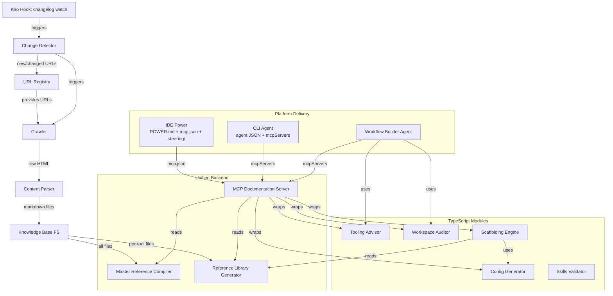
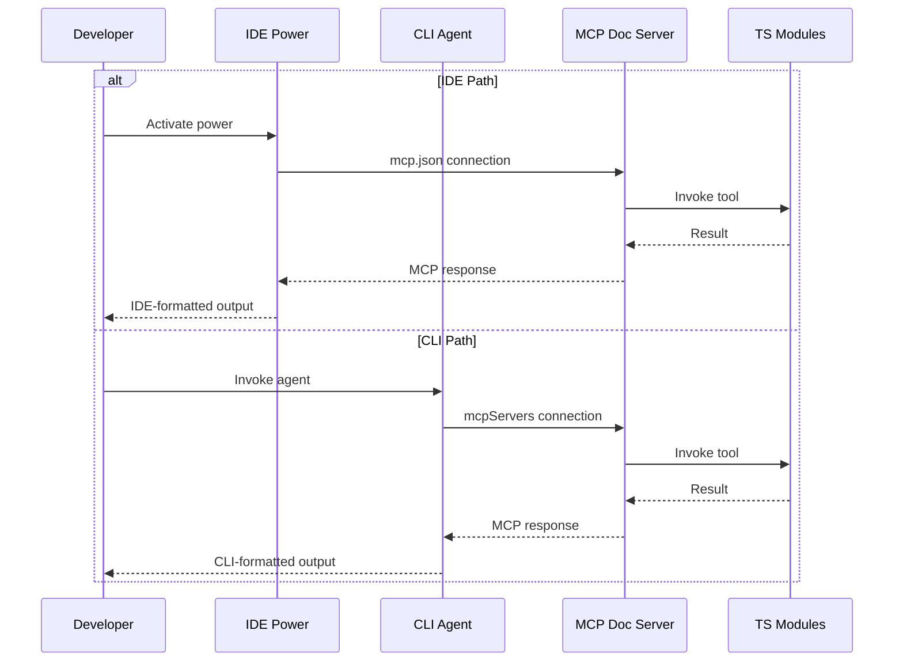
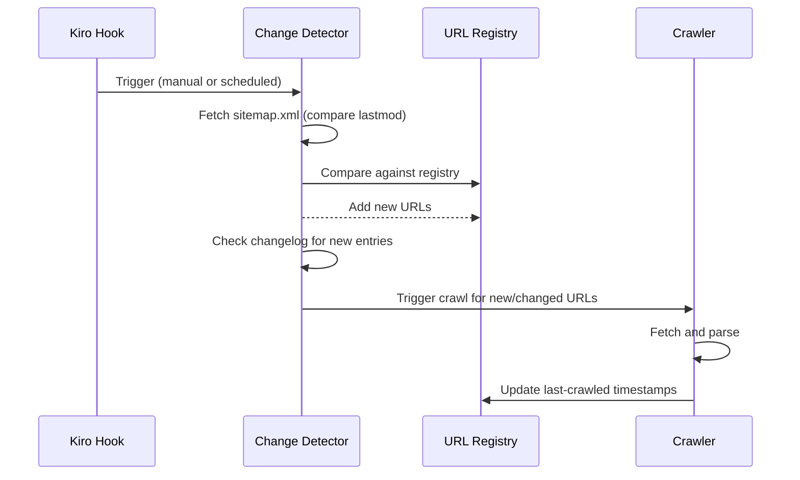
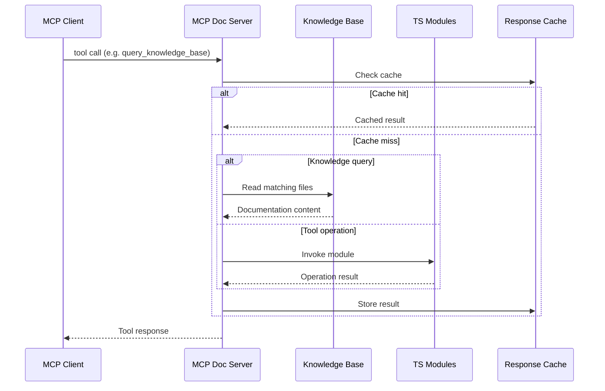

# Design Document: Kiro Knowledge Base

## Overview

The Kiro Knowledge Base is a TypeScript-based system that crawls,
organizes, and serves Kiro IDE/CLI/Autonomous Agent documentation
as a structured knowledge base. The system uses a unified core
architecture where the MCP Documentation Server is the shared
backend consumed by both IDE (Kiro Power) and CLI (Custom Agent)
delivery layers.

The system has six layers:

1. **Data Layer** - URL registry, content storage, change
   tracking
2. **Crawl Layer** - Fetches URLs, parses HTML to markdown
3. **Compilation Layer** - Aggregates content into a master
   reference document and a reference library of per-tool-type
   best practices, examples, and templates
4. **Generation Layer** - Config generator with schema
   validation for all Kiro tool types, plus interactive
   scaffolding
5. **Unified Backend** - MCP Documentation Server that wraps
   all TypeScript modules (Config Generator, Tooling Advisor,
   Scaffolding Engine, Workspace Auditor) and exposes them via
   MCP protocol
6. **Platform Delivery Layer** - IDE power and CLI agent as
   thin presentation layers consuming the MCP Documentation
   Server; plus the Workflow Builder agent for end-to-end
   guided flows

All components are implemented as TypeScript modules using
Node.js, designed to run as CLI scripts or be invoked by Kiro
hooks. The MCP Documentation Server is deployable as local
stdio (development) or remote HTTP/SSE (shared team use).

### Project Structure and Portability

The project lives at `tools/kiro-knowledge-base/` as a
self-contained Node.js package. All paths in this document
are relative to the project root
(`tools/kiro-knowledge-base/`). Setup: `npm install` then
`npm test`. CLI scripts use `tsx` for direct TypeScript
execution (no build step). The MCP server command in both
the IDE power mcp.json and CLI agent mcpServers uses
`npx tsx bin/mcp-server.ts`.

```
tools/kiro-knowledge-base/
  lib/                  # TypeScript modules
  tests/lib/            # vitest + fast-check tests
  bin/                  # CLI entry points (tsx)
  powers/               # IDE power (POWER.md + mcp.json)
    kiro-knowledge-base/
      POWER.md
      mcp.json
      steering/
  agents/               # CLI agent configs
  knowledge-base/       # Crawled content output
  reference-library/    # Generated reference docs
  package.json
  tsconfig.json         # bundler moduleResolution
  vitest.config.ts
```

### TypeScript Configuration

The tsconfig.json uses `bundler` moduleResolution with
`paths` mapping for `@modelcontextprotocol/sdk` subpath
imports (e.g., `@modelcontextprotocol/sdk/server/stdio`,
`@modelcontextprotocol/sdk/types`,
`@modelcontextprotocol/sdk/server/index`). Each path maps
to the corresponding `.d.ts` file under
`node_modules/@modelcontextprotocol/sdk/dist/esm/`.

Cheerio DOM types (`Element`, `Text`) are imported from the
`domhandler` package, which is a transitive dependency via
cheerio. No direct dependency on `domhandler` is needed.

### Architecture Decision: Why MCP

Kiro powers and CLI agents can only consume external tool
functionality through MCP servers. There is no mechanism for
a power to import a TypeScript module — powers get POWER.md +
mcp.json + steering/. CLI agents get mcpServers + resources +
hooks. MCP is the only tool integration point.

The hybrid approach: CLI entry points (bin/*.ts) import
TypeScript modules directly for zero-overhead batch operations.
IDE power and CLI agents use MCP for interactive tool access.
Local stdio MCP adds ~10-50ms per call (JSON-RPC over pipe),
negligible vs LLM inference time.

## Architecture



### Data Flow

1. The URL_Registry is seeded from `kiro.dev/sitemap.xml` and
   agentskills.io pages
2. The Crawler fetches each URL and hands HTML to the
   Content_Parser
3. The Content_Parser converts HTML to clean markdown and writes
   files to the Knowledge_Base directory
4. The Master_Reference Compiler reads all markdown files and
   produces a single optimized reference document
5. The Reference_Library Generator produces per-tool-type
   best-practices, examples, and templates documents
6. The Config_Generator validates and produces configuration
   files for all Kiro tool types with schema enforcement
7. The MCP_Documentation_Server wraps all TypeScript modules
   (Config Generator, Tooling Advisor, Scaffolding Engine,
   Workspace Auditor) and exposes them as MCP tools
8. The IDE Power (`powers/kiro-knowledge-base/`)
   connects to the MCP_Documentation_Server via mcp.json and
   provides steering files for IDE-specific workflows
9. The CLI Agent (`agents/kiro-knowledge-base-agent.json`)
   connects to the same MCP_Documentation_Server via
   mcpServers config for CLI-specific workflows
10. The Workflow_Builder Agent orchestrates end-to-end flows,
    consuming the MCP_Documentation_Server for knowledge base
    access, recommendations, and scaffolding

### Platform Delivery Flow



### Change Detection Flow



### MCP Documentation Server Flow




## Components and Interfaces

### MCP Documentation Server (`lib/mcpServer.ts`)

The unifying backend. Wraps all TypeScript modules and exposes
them via MCP protocol. Used by IDE power (via mcp.json) and
CLI agents (via mcpServers). CLI entry points (bin/*.ts) bypass
this and import modules directly for batch operations.

```typescript
interface McpDocServer {
  // Knowledge base queries
  query_knowledge_base(params: {
    topic?: string;
    toolType?: KiroToolType;
    searchTerm?: string;
  }): Promise<DocumentationSection[]>;

  // Decision support
  get_decision_matrix(): Promise<DecisionMatrix>;

  // Templates
  get_template(params: {
    toolType: KiroToolType;
  }): Promise<ToolTemplate>;

  // Scaffolding (delegates to ScaffoldingEngine)
  scaffold_tool(params: {
    toolType: KiroToolType;
    options: ScaffoldOptions;
  }): Promise<ScaffoldResult>;

  // Validation (delegates to ConfigGenerator)
  validate_config(params: {
    toolType: KiroToolType;
    config: unknown;
  }): Promise<ValidationResult>;

  // Audit (delegates to WorkspaceAuditor)
  audit_workspace(params: {
    workspacePath: string;
  }): Promise<AuditReport>;

  // Platform guidance
  get_platform_guide(params: {
    platform: 'ide' | 'cli' | 'both';
  }): Promise<PlatformGuide>;
}
```

### Platform Delivery Configs

**IDE Power** (`powers/kiro-knowledge-base/`):

```
powers/kiro-knowledge-base/
  POWER.md              # Power manifest with frontmatter
  mcp.json              # Points to MCP Documentation Server
  steering/
    ide-workflows.md    # Power, hook, steering creation
    cli-workflows.md    # Agent, CLI hook, KB resources
    cross-platform.md   # MCP, skills, shared steering
    tooling-decision-guide.md
    workspace-audit-guide.md
    tool-templates.md
```

**CLI Agent** (`agents/kiro-knowledge-base-agent.json`):

```json
{
  "name": "kiro-knowledge-base",
  "description": "Kiro Knowledge Base assistant",
  "mcpServers": {
    "kiro-kb": {
      "command": "npx",
      "args": ["tsx", "bin/mcp-server.ts"]
    }
  },
  "resources": ["file://knowledge-base/**"],
  "welcomeMessage": "Options:\n1. Create IDE Tool\n2. Create CLI Tool\n3. Create Cross-Platform Tool\n4. Audit Workspace\n5. Optimize Workflows"
}
```

### Config Generator (`lib/configGenerator.ts`)

Produces valid, schema-compliant configs for all Kiro tool types.
Used directly by the MCP server's `validate_config` and
`scaffold_tool` tools.

### Tooling Advisor (`lib/toolingAdvisor.ts`)

Recommends tool types with rationale, KB refs, platform info,
and credit cost awareness. Used by the MCP server's
`get_decision_matrix` and `query_knowledge_base` tools.

### Scaffolding Engine (`lib/scaffoldingEngine.ts`)

Interactive and programmatic tool creation with templates.
Platform-aware: includes mcp.json template for powers,
mcpServers config template for CLI agents, and composite
integration packages (MCP server + power + agent).

### Workspace Auditor (`lib/workspaceAuditor.ts`)

Scans workspace for all Kiro config files and compares against
best practices. Used by the MCP server's `audit_workspace` tool.

### Skills Validator (`lib/skillsValidator.ts`)

Validates Agent Skills spec compliance for SKILL.md frontmatter,
name rules, and directory structure.

### Workflow Builder (`lib/workflowBuilder.ts`)

Orchestrates end-to-end integration creation and optimization.
Consumes the MCP Documentation Server via mcpServers config.
Platform-aware: asks preferred platform (IDE, CLI, both) during
requirements gathering and generates platform-appropriate
outputs.

## Data Models

### Core Types

```typescript
interface RegistryEntry {
  url: string;
  category: UrlCategory;
  source: 'sitemap' | 'agentskills' | 'manual';
  lastCrawled: string | null;
  lastmod: string | null;
  status: 'active' | 'stale' | 'failed';
}

interface ParsedContent {
  title: string;
  description: string;
  headings: Array<{ level: number; text: string }>;
  markdown: string;
  codeBlocks: Array<{ language: string; content: string }>;
  tables: string[];
  links: string[];
  metadata: Record<string, string>;
  frontmatter: Record<string, unknown> | null;
}

interface CompiledReference {
  toc: TocEntry[];
  sections: ReferenceSection[];
  decisionMatrix: DecisionMatrixEntry[];
  quickReference: ScenarioMapping[];
}

interface AuditReport {
  findings: AuditFinding[];
  summary: { critical: number; recommended: number; optional: number };
  scannedFiles: string[];
}
```

### MCP Server Types

```typescript
interface DocumentationSection {
  topic: string;
  toolType: KiroToolType | null;
  content: string;
  source: string;
}

interface PlatformGuide {
  platform: 'ide' | 'cli' | 'both';
  setupInstructions: string;
  capabilities: string[];
  workflows: string[];
  configTemplate: Record<string, unknown>;
}

interface ScaffoldResult {
  files: Array<{ path: string; content: string }>;
  instructions: string;
}

interface ValidationResult {
  isValid: boolean;
  errors: Array<{ field: string; message: string }>;
}
```

### Platform Config Types

```typescript
interface PowerMcpJson {
  mcpServers: Record<string, {
    command: string;
    args: string[];
  } | {
    url: string;
    headers?: Record<string, string>;
  }>;
}

interface CliAgentConfig {
  name: string;
  description: string;
  prompt?: string;
  model?: string;
  tools?: string[];
  allowedTools?: string[];
  mcpServers?: Record<string, McpServerDef>;
  resources?: string[];
  hooks?: Record<string, unknown>;
  welcomeMessage?: string;
}
```


## Correctness Properties

*A property is a characteristic or behavior that should hold
true across all valid executions of a system — essentially, a
formal statement about what the system should do. Properties
serve as the bridge between human-readable specifications and
machine-verifiable correctness guarantees.*

### Existing Properties (1-34)

Properties 1-34 from the original design remain unchanged.
They cover URL Registry, Crawler, Content Parser, Knowledge
Base FS, Master Reference Compiler, Reference Library,
Change Detector, Tooling Advisor, Config Generator, Workspace
Auditor, and Skills Validator.

### New Properties for Platform-Aware Architecture

**Property 35: Platform-specific output structure**

*For any* platform selection (ide, cli, both) and any tool
creation request, the Master_Tool output SHALL contain the
correct platform-specific files: POWER.md + mcp.json +
steering/ for IDE, agent JSON with mcpServers for CLI, or
both sets for "both" platform.

**Validates: Requirements 7.7, 7.8, 7.9, 7.10**

**Property 36: MCP server tool completeness**

*For any* valid KiroToolType, the MCP_Documentation_Server
SHALL expose all registered tools (query_knowledge_base,
get_decision_matrix, get_template, scaffold_tool,
validate_config, audit_workspace, get_platform_guide) and
each tool SHALL return a well-formed response for valid input.

**Validates: Requirements 8.1, 8.2, 8.3, 8.8, 8.9, 8.10,
8.11**

**Property 37: MCP server cache idempotence**

*For any* query to the MCP_Documentation_Server, calling the
same query twice SHALL return identical results, and the
second call SHALL be served from cache.

**Validates: Requirements 8.7**

**Property 38: MCP server validate_config round-trip**

*For any* valid configuration produced by the Config_Generator,
passing it to the MCP server's validate_config tool SHALL
return isValid=true with zero errors.

**Validates: Requirements 8.9, 5.8**

**Property 39: Scaffolding platform-aware MCP references**

*For any* scaffolded power, the output SHALL include an
mcp.json referencing the MCP_Documentation_Server. *For any*
scaffolded CLI agent, the output SHALL include an mcpServers
config referencing the same server.

**Validates: Requirements 11.10, 11.11**

**Property 40: Composite integration completeness**

*For any* composite integration request, the Scaffolding_Engine
output SHALL contain an MCP server config, an IDE power
directory, and a CLI agent JSON, all referencing the same
MCP_Documentation_Server instance.

**Validates: Requirements 11.12**

**Property 41: Workflow Builder platform-coordinated output**

*For any* integration request with platform="both", the
Workflow_Builder output SHALL contain a shared MCP server
config, an IDE power, and a CLI agent, with all MCP server
references pointing to the same instance.

**Validates: Requirements 10.14**

**Property 42: Cross-platform MCP server consistency**

*For any* generated IDE power and CLI agent pair, the MCP
server reference in the power's mcp.json SHALL match the
MCP server reference in the agent's mcpServers config,
ensuring consistent knowledge base access.

**Validates: Requirements 13.5**

## Error Handling

### MCP Documentation Server Errors

- **Knowledge base unavailable**: Return structured MCP error
  with `isRetryable: true` and descriptive message. Graceful
  degradation: serve cached content if available.
- **Invalid tool parameters**: Return MCP error with field-level
  validation messages. Do not crash the server.
- **Module failure**: If a wrapped TypeScript module throws,
  catch and return structured error with the module name and
  error details.
- **Transport errors**: For HTTP/SSE mode, return appropriate
  HTTP status codes (503 for unavailable, 400 for bad request).

### Platform Delivery Errors

- **mcp.json misconfigured**: IDE power fails gracefully with
  a steering file message explaining how to fix the MCP server
  connection.
- **mcpServers unreachable**: CLI agent retries connection with
  exponential backoff, then falls back to file:// resources.
- **Composite generation partial failure**: If one platform
  output fails, still generate the other and report the failure
  in the build summary.

### Existing Error Handling

All existing error handling for Crawler (retry with backoff),
URL Registry (stale marking), Change Detector (state
preservation), Config Generator (validation errors), and
Workspace Auditor (graceful scan failures) remains unchanged.

## Testing Strategy

### Property-Based Testing

- Library: `fast-check` for TypeScript
- Minimum 100 iterations per property test
- Each test tagged with: **Feature: kiro-knowledge-base,
  Property {N}: {title}**
- Each correctness property implemented as a single
  property-based test

### Unit Testing

- Framework: `vitest`
- Focus on specific examples, edge cases, error conditions
- Avoid excessive unit tests where property tests provide
  better coverage

### New Test Areas for Platform Architecture

**MCP Documentation Server tests**:
- Property tests for tool completeness (Property 36)
- Property tests for cache idempotence (Property 37)
- Property tests for validate_config round-trip (Property 38)
- Unit tests for health check endpoint
- Unit tests for stdio vs HTTP/SSE transport selection

**Platform delivery tests**:
- Property tests for platform-specific output (Property 35)
- Property tests for scaffolding MCP refs (Property 39)
- Property tests for composite completeness (Property 40)
- Property tests for cross-platform consistency (Property 42)
- Unit tests for IDE power directory structure
- Unit tests for CLI agent JSON schema compliance
- Unit tests for welcomeMessage content

**Workflow Builder platform tests**:
- Property tests for coordinated output (Property 41)
- Unit tests for platform selection in requirements gathering
- Unit tests for "both" platform composite generation

### Existing Test Coverage

All existing property tests (1-34) and unit tests for URL
Registry, Crawler, Content Parser, Knowledge Base FS, Master
Reference Compiler, Reference Library, Change Detector,
Tooling Advisor, Config Generator, Workspace Auditor, Skills
Validator, and Workflow Builder remain unchanged.
